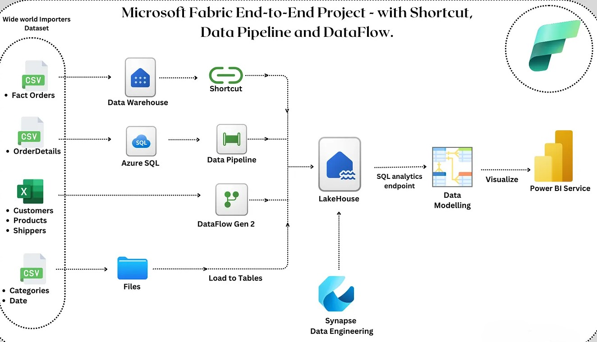

# World Wide Importers Microsoft Fabric Project

# Project Overview

Microsoft Fabric is a comprehensive analytics platform that integrates data ingestion, transformation, real-time analytics, and dashboard reporting. It unifies data engineering, data science, and analytics, making it an ideal enterprise solution.

## Architecture Overview 

# Project Objectives

The goal of this project is to:
1. Set up a new Microsoft Fabric Lakehouse.
2. Ingest data into the Lakehouse using different methods, including:
   * Shortcuts
   * Data Pipelines
   * Dataflows
   * File Uploads
3. Perform data modeling for efficient querying and analytics.
4. Visualize data using Power BI.

# Project Prerequisites

Before starting, ensure the following:

  * Microsoft Fabric Trial Account: Sign up for a trial account to access Fabric services.
  * Wide World Importers Dataset: Download the dataset used in this project.
  * Azure SQL Database (Optional): Create an Azure SQL Database or use an on-premises database of choice.

### Step 1: Create a New Lakehouse
  * Navigate to Synapse Data Engineering in Microsoft Fabric.
  * Create a new Lakehouse named WWI_ProjectLakehouse.
  * This serves as the central repository for structured and semi-structured data.

### Step 2: Data Ingestion into the Lakehouse

Data is ingested into the Lakehouse using four different methods:

2.1 Using a Shortcut to Warehouse (Fact Table - WWI_FactOrders)
  * A Data Warehouse named FabricProjectWarehouse is created.
  * The WWI_FactOrders dataset is ingested into the warehouse using Dataflow Gen2.
  * Instead of duplicating data, a Shortcut is created to reference the FactOrders table in FabricProjectWarehouse.

  Steps to create a Shortcut:
    * Open WWI_ProjectLakehouse.
    * Click on New Shortcut.
    * Select Internal Sources > Microsoft OneLake.
    * Choose FabricProjectWarehouse > Tables > WWI_FactOrders.
    * Click Create to successfully link the data.

2.2 Using Data Factory Pipeline to Ingest Order Details (WWI_OrderDetails)

A Data Pipeline named WWI_pipeline_OrderDetails is created to load data from Azure SQL Database into the Lakehouse.

Steps to configure the pipeline:
  * Select New Data Pipeline from the Lakehouse.
  * Choose Azure SQL Database as the data source.
  * Create a connection by setting credentials and connection settings.
  * Select dbo.WWI_OrderDetails and set the destination as WWI_ProjectLakehouse.
  * Save and validate the pipeline.

2.3 Uploading CSV Files for Dimension Tables
  * CSV files for Categories, Date, Shippers, and Products are uploaded directly to the WWI_ProjectLakehouse.
  * These are then loaded into tables in the Lakehouse.

2.4 Using Dataflows to Load Excel Files for Dimension Tables
  * Since Excel files cannot be directly loaded into tables, Dataflow Gen 2 is used to process Customers and Products data.
    Steps to create a Dataflow:
      * Go to Lakehouse > Get Data > Dataflow Gen 2.
      * Select the Excel file from OneDrive or upload from local storage.
      * Publish the Dataflow.
      * Repeat the process for WWI_Customers.
   
### Step 3: Data Modeling

  * Open WWI_ProjectLakehouse and switch to SQL Analytics Endpoint.
  * Navigate to the Model tab to define relationships between tables.
  * The model follows a Snowflake Schema, optimizing data retrieval.

### Step 4: Data Visualization in Power BI

  * Connect Power BI Service to WWI_ProjectLakehouse.
  * Create New Measures in OrderDetails Table using DAX.
  * If the New Measure option is disabled, go to Reporting > Manage Default Semantic Model to activate it.
  * Develop a dashboard with key insights from 1996-1998.

Dashboard Insights Include:
  * Sales performance over time.
  * Order trends by category and customer demographics.
  * Shipping and fulfillment analysis.

## Conclusion

This project successfully demonstrates an end-to-end implementation of Microsoft Fabric’s Data Engineering & Analytics capabilities. By leveraging multiple data ingestion methods, performing structured data modeling, and integrating Power BI for visualization, we create a scalable, efficient, and unified analytics solution. The project showcases how Microsoft Fabric can be used for enterprise-level data transformation and reporting, providing actionable insights through real-time data processing.
